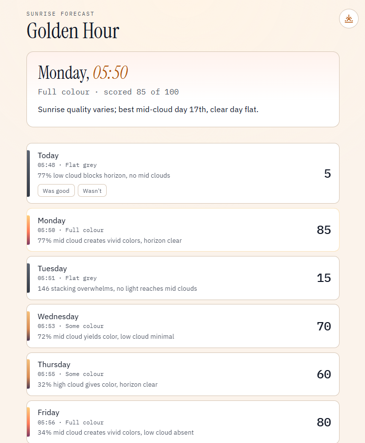

# Golden Hour

Scores the next seven sunrises and sunsets so you know which one is most worth seeing.

## Webapp Screenshot


## Run it

```bash
# macOS / Linux
python3 -m venv venv && source venv/bin/activate

# Windows
py -m venv venv && venv\Scripts\activate

pip install -r requirements.txt
```

Create a `.env` file in the project root:

```
GEMINI_API_KEY=your-key-here     # free from aistudio.google.com
```

Then:

```bash
uvicorn app:app --reload         # open http://127.0.0.1:8000
```

## How it works

Open-Meteo provides raw weather numbers for each day:
- Cloud cover split by altitude, hourly
- Humidity, visibility, and pressure, hourly
- Sunrise and sunset times

These features are organised into a prompt, and an LLM returns a score out of 100 and a line of reasoning for each morning and evening.

To avoid any crashes if the model is unavailable (no API key, a timeout, no network), a score is also calculated through a hand-written ruleset. On an error, the score is shown instead. 

### Autonomous self-improving loop
Every past date in the UI has both a thumbs up and a thumbs down. Tapping one appends a line of the raw weeather features and the score to 'log.jsonl'. These are fed back as a summary into the end of the prompt (in particularly where the prediction and verdict disagreed the most) to automatically improve the LLM's reasoning without human intervention.

## Tests

Run the following command:
```bash
pytest
```